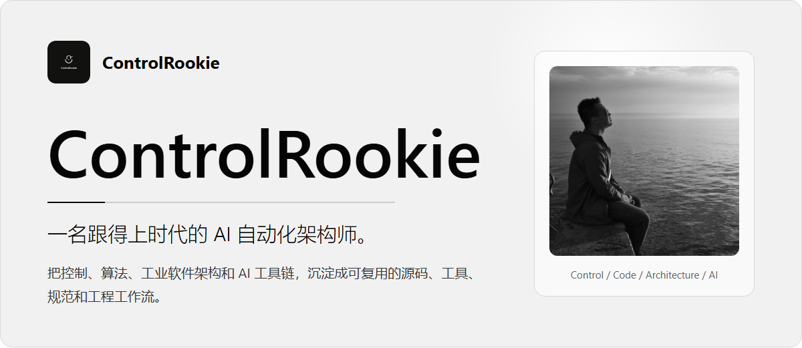
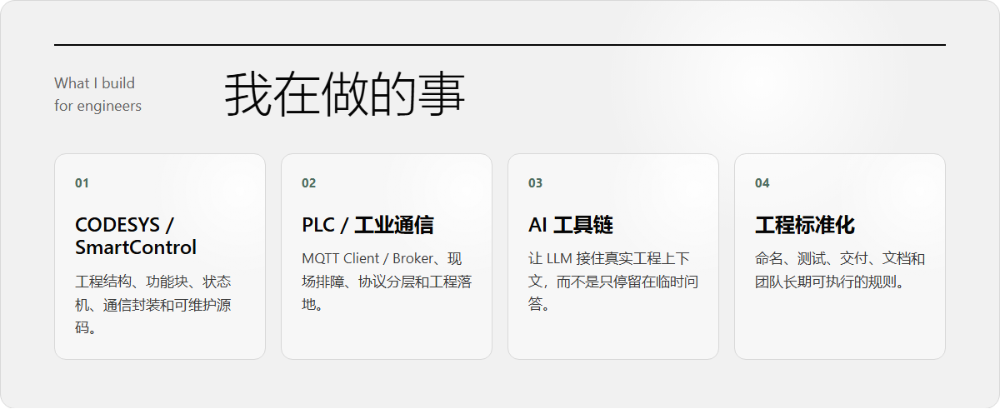
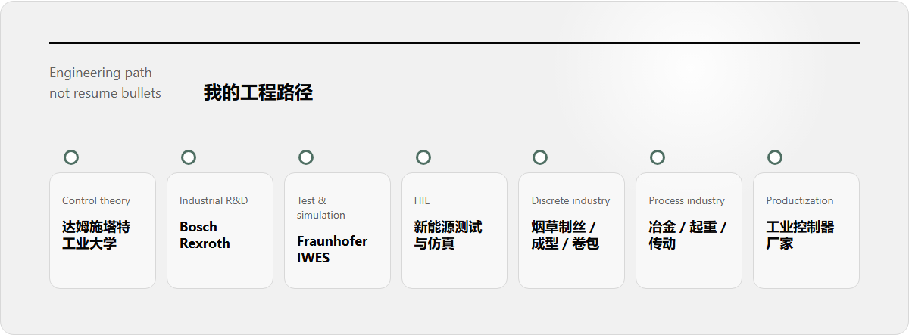
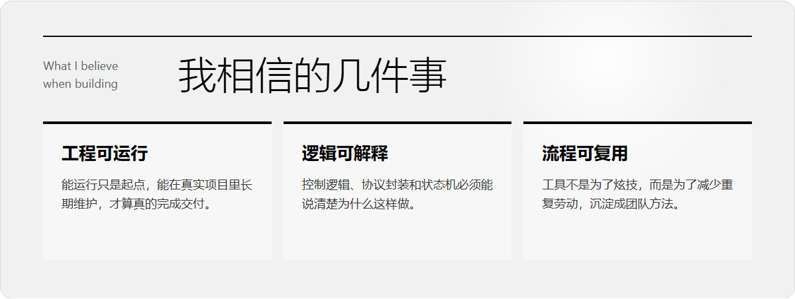

  

# ControlRookie

我不是从 PPT 里的架构图开始做自动化的。

从 **达姆施塔特工业大学** 的控制理论和系统建模，到 **Bosch Rexroth** 的德国工业研发体系，再到 **Fraunhofer IWES** 的新能源测试与仿真验证，后面又经历了新能源 HIL、烟草制丝 / 成型 / 卷包、冶金起重传动、全厂集控系统和工业控制器厂家。

这些经历让我越来越确定一件事：工业现场的问题，很少只靠一个漂亮函数、一个库、一个 AI 提示词就能解决。真正有价值的是把控制逻辑、通信协议、工程结构、测试验证、文档规范和团队协作放在同一个工程系统里思考。

---

### 我在做的事

  

**CODESYS / SmartControl**  
工程结构、功能块、状态机、通信封装和可维护源码。

**PLC / 工业通信**  
MQTT Client / Broker、现场排障、协议分层和工程落地。

**AI 工具链**  
让 LLM 接住真实工程上下文，而不是只停留在临时问答。

**工程标准化**  
命名、测试、交付、文档和团队长期可执行的规则。

---

### 我的工程路径

  

我更愿意把自己放在一个工程链条里介绍：控制理论、工业研发、仿真验证、现场项目、行业应用、控制器产品化。  
每一段经历都在提醒我，自动化工程不是只写一段 ST 代码，而是把需求、控制、通信、排障、交付和长期维护全部接起来。

---

### 我相信的几件事

  

**AI 生成内容不稀缺，稀缺的是工程判断。**  
知道该做什么、不该做什么、哪里会出问题，这件事暂时还得靠工程经验。

**能运行只是起点，能维护才算交付。**  
控制逻辑、协议封装、状态机、异常处理和文档规范，必须能被后来的人读懂、接手和复用。

**工具不是为了炫技，而是为了减少重复劳动。**  
我更关心一个工具能不能进入真实工程流程，能不能让自动化工程师少一点低价值消耗。

---

### 找到我

主要阵地 · [ControlRookie 官网](https://benpeng0205.github.io/) · [CSDN 技术博客](https://blog.csdn.net/weixin_44442562?type=blog)  
邮箱合作 · ben_peng0205@hotmail.com
