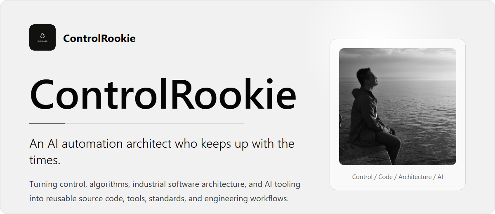
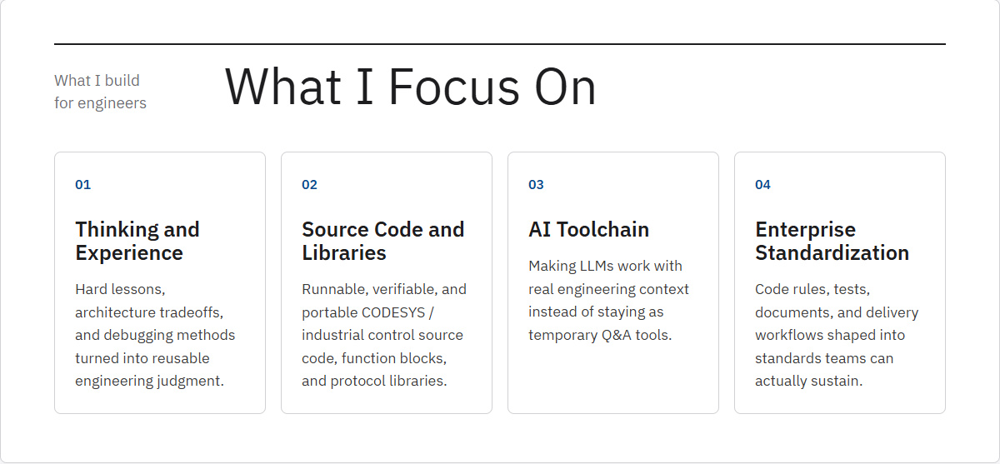
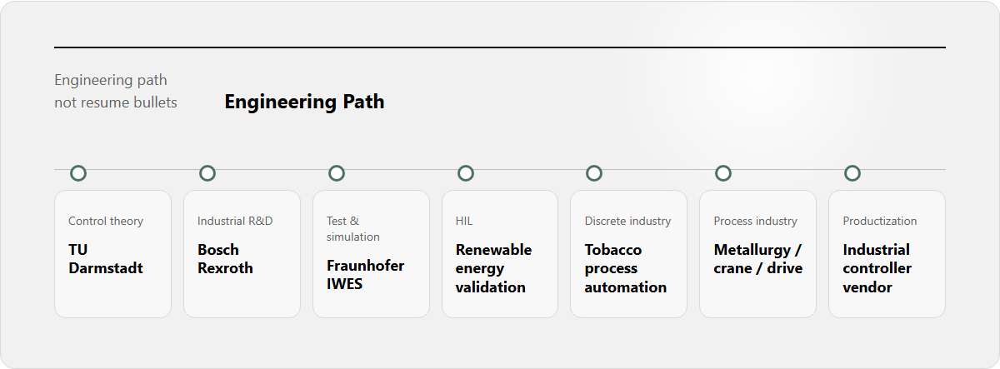
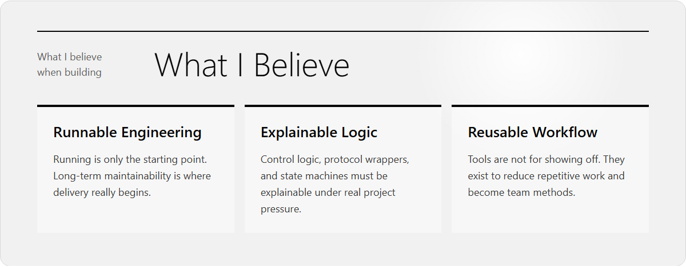
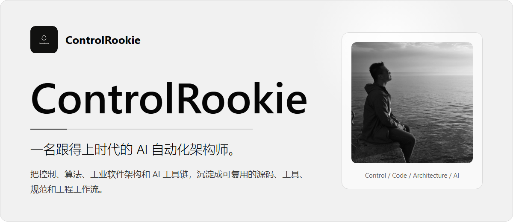
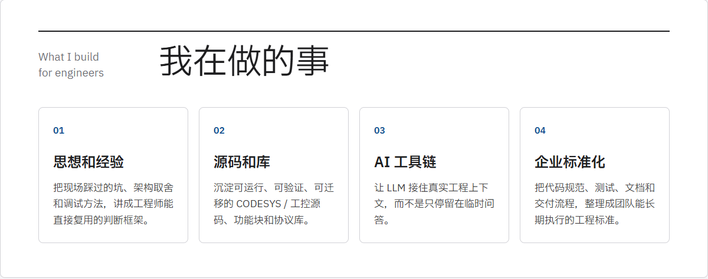
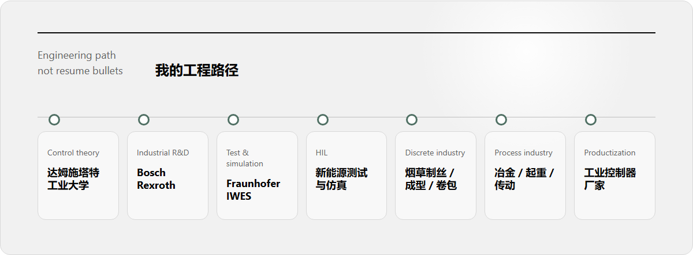
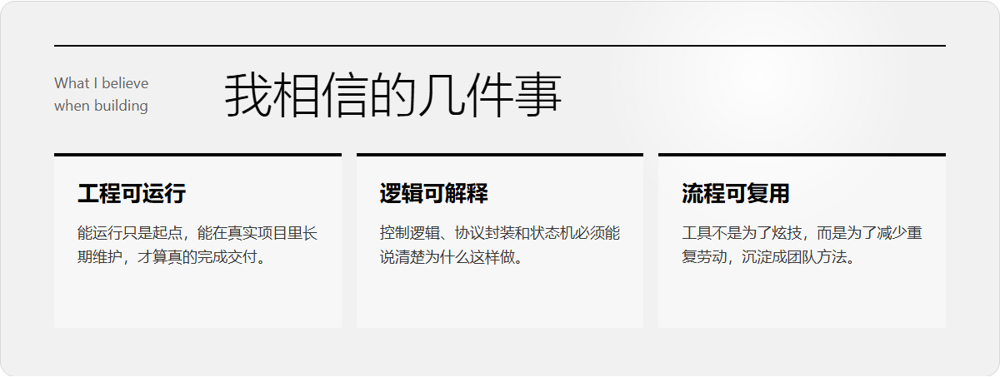

  <a href="#english"><strong>English</strong></a>
  ·
  <a href="#中文">中文</a>

  

# ControlRookie

I did not start automation from architecture diagrams in slides.

My path runs from control theory and system modeling at **TU Darmstadt**, to the German industrial R&D discipline at **Bosch Rexroth**, then to renewable energy testing and simulation validation at **Fraunhofer IWES**. After that, I worked across renewable-energy HIL, tobacco process automation, metallurgy and drive systems, plant-wide control systems, and industrial controller vendors.

These experiences keep reminding me of one thing: real industrial problems are rarely solved by one elegant function, one library, or one AI prompt. The valuable work is connecting control logic, communication protocols, project structure, test validation, documentation standards, and team collaboration into one engineering system.

---

### What I Focus On

  

**Thinking and Experience**
Hard lessons, architecture tradeoffs, and debugging methods turned into reusable engineering judgment.

**Source Code and Libraries** 
Runnable, verifiable, and portable CODESYS / industrial control source code, function blocks, and protocol libraries.

**AI Toolchain**  
Making LLMs work with real engineering context instead of staying as temporary Q&A tools.

**Enterprise Standardization** 
Code rules, tests, documents, and delivery workflows shaped into standards teams can actually sustain.

---

### Engineering Path

  

I prefer to introduce myself as part of an engineering chain: control theory, industrial R&D, simulation validation, field projects, industry applications, and controller productization.  
Every stage reminds me that automation engineering is not just writing a piece of ST code. It is connecting requirements, control, communication, troubleshooting, delivery, and long-term maintenance.

---

### What I Believe

  

**AI-generated output is not scarce. Engineering judgment is.**  
Knowing what should be done, what should not be done, and where things will break still depends heavily on engineering experience.

**Running is only the starting point. Maintainability is delivery.**  
Control logic, protocol wrappers, state machines, exception handling, and documentation standards must be readable, transferable, and reusable.

**Tools are not for showing off. They reduce repeated work.**  
I care more about whether a tool can enter a real engineering workflow and reduce low-value workload for automation engineers.

---

### Find Me

Main site · [ControlRookie](https://benpeng0205.github.io/) · [CSDN Blog](https://blog.csdn.net/weixin_44442562?type=blog)  
Email · ben_peng0205@hotmail.com

  <a href="#english"><strong>English</strong></a>
  ·
  <a href="#中文">中文</a>

  

# ControlRookie

我不是从 PPT 里的架构图开始做自动化的。

从 **达姆施塔特工业大学** 的控制理论和系统建模，到 **Bosch Rexroth** 的德国工业研发体系，再到 **Fraunhofer IWES** 的新能源测试与仿真验证，后面又经历了新能源 HIL、烟草制丝 / 成型 / 卷包、冶金起重传动、全厂集控系统和工业控制器厂家。

这些经历让我越来越确定一件事：工业现场的问题，很少只靠一个漂亮函数、一个库、一个 AI 提示词就能解决。真正有价值的是把控制逻辑、通信协议、工程结构、测试验证、文档规范和团队协作放在同一个工程系统里思考。

---

### 我在做的事

  

**思想和经验**
把现场踩过的坑、架构取舍和调试方法，讲成工程师能直接复用的判断框架。

**源码和库** 
沉淀可运行、可验证、可迁移的 CODESYS / 工控源码、功能块和协议库。

**AI 工具链**  
让 LLM 接住真实工程上下文，而不是只停留在临时问答。

**企业标准化** 
把代码规范、测试、文档和交付流程，整理成团队能长期执行的工程标准。

---

### 我的工程路径

  

我更愿意把自己放在一个工程链条里介绍：控制理论、工业研发、仿真验证、现场项目、行业应用、控制器产品化。  
每一段经历都在提醒我，自动化工程不是只写一段 ST 代码，而是把需求、控制、通信、排障、交付和长期维护全部接起来。

---

### 我相信的几件事

  

**AI 生成内容不稀缺，稀缺的是工程判断。**  
知道该做什么、不该做什么、哪里会出问题，这件事暂时还得靠工程经验。

**能运行只是起点，能维护才算交付。**  
控制逻辑、协议封装、状态机、异常处理和文档规范，必须能被后来的人读懂、接手和复用。

**工具不是为了炫技，而是为了减少重复劳动。**  
我更关心一个工具能不能进入真实工程流程，能不能让自动化工程师少一点低价值消耗。

---

### 找到我

主要阵地 · [ControlRookie 官网](https://benpeng0205.github.io/) · [CSDN 技术博客](https://blog.csdn.net/weixin_44442562?type=blog)  
邮箱合作 · ben_peng0205@hotmail.com
